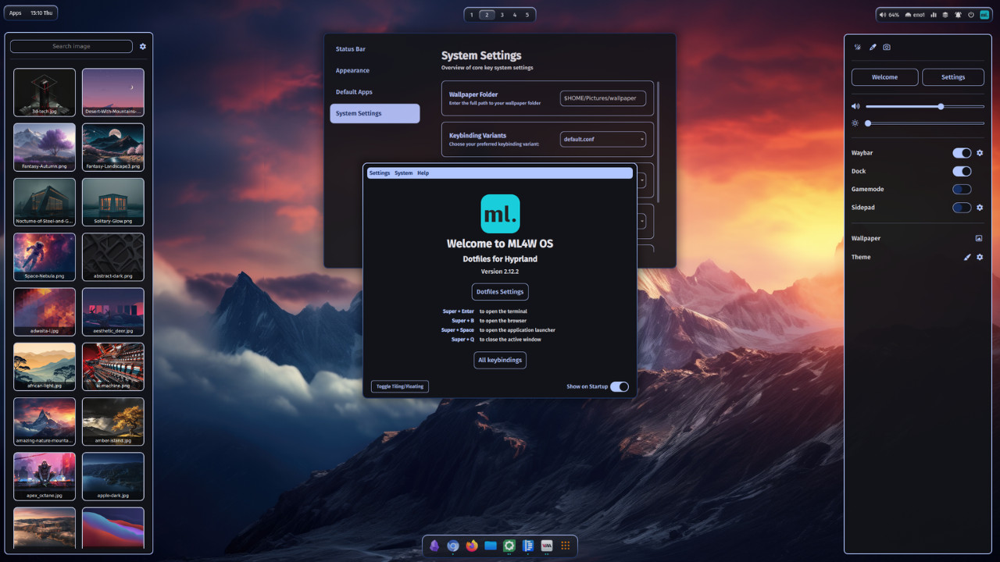

# Linux Window Managers — Dotfile Evaluation

Systematic evaluation of Hyprland and KDE Plasma dotfile repositories. Cloned, examined, graded.

## What's Here

### `showcase/` — Interactive Website
- `index.html` — Full evaluation with real screenshots from repos
- `screenshots/` — Real screenshots downloaded from each repo's own assets

### `docs/evaluation/` — Research Documents
- `full-evaluation.md` — Complete 34-program grade matrix across 10 repos
- `terminal-vs-gui.md` — Terminal vs GUI file mapping for all programs
- `improvements-plan.md` — 10 project improvements with implementation status
- `decomposition-notes.md` — Hand analysis of first 5 repos
- `compatibility-matrix.md` — Compatibility groups for config swapping
- `dotfile-decomposition.md` — Initial decomposition framework
- `dotfile-research.md` — Initial research findings
- `full-decomposition.md` — Extended decomposition data

### `scripts/` — Tools
- `switch-de.sh` — Desktop theme switcher (KDE 15 themes + Hyprland 10 repos)
- `transition-kde.sh` — KDE Plasma 6 installer with Surface support
- `transition-hyprland.sh` — Hyprland installer with Surface support

### `skills/` — Agent Skills
- `dotfile-repo-evaluator/SKILL.md` — Systematic dotfile repo evaluation skill

## Stats
- **21 repos cloned** for analysis
- **12 real screenshots** downloaded from repos
- **34 programs graded** with S/A/B/C/D/F letter grades
- **340 individual grades** across all repos
- **0 fake content** — all data from actual repo examination
